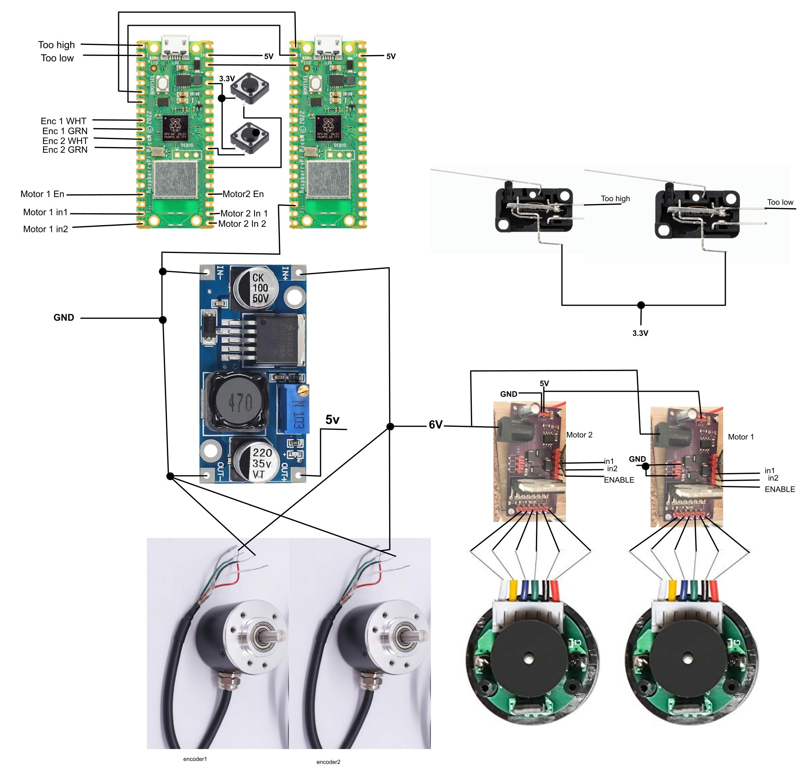
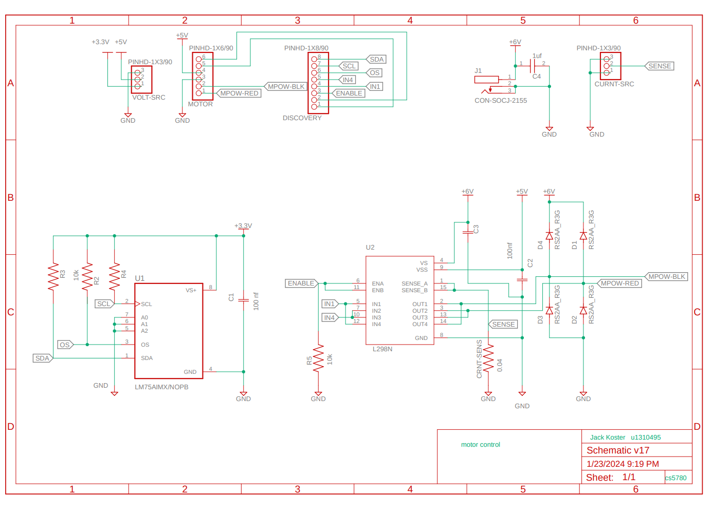
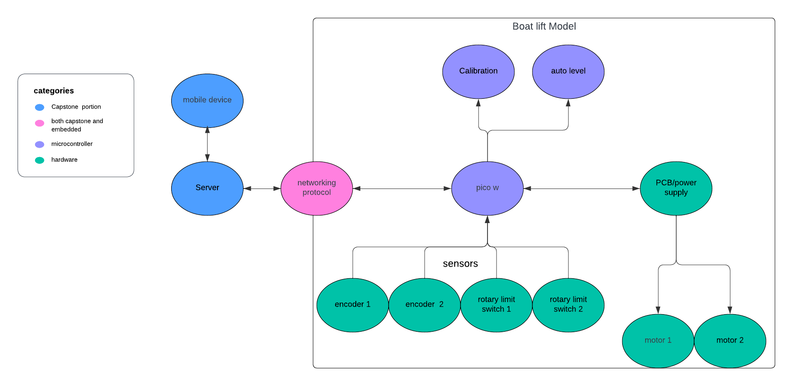
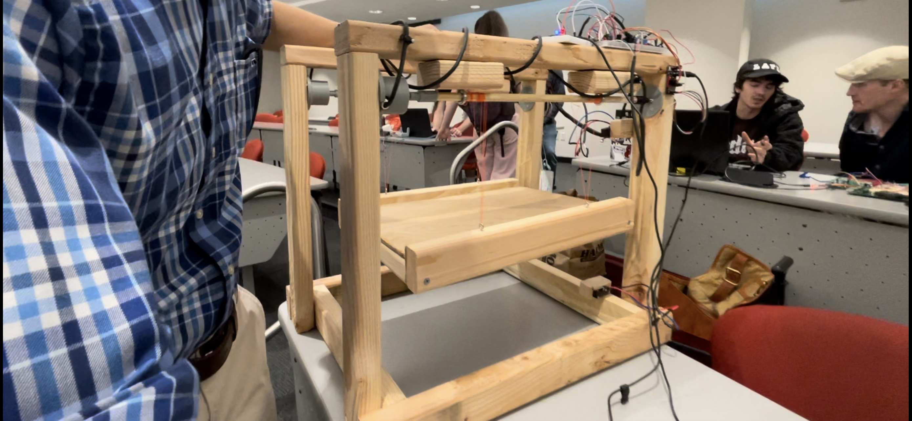

Jack Koster  
Henry Silverman  
Aidan Case  
Tenace Crane

# Miniature boat Lift

## Purpose

The purpose of this project is a proof of concept that a boat lift could be automated and controlled wirelessly. Often permanent boat lifts take a long time to use and require you to be present engaging a physical switch.

## Functionality

Raspberry pi pico w #1

* Two physical buttons that move the lift up or down while one is being held down
* Limit switches that notify the system when the platform had reached its highest or lowest point
* Encoders to keep track of where both sides of the platform are at any given moment (separate from the ones built into the motors)
* DC motors to move the platform up and down driven by the motor driver PCBs we designed in the labs

Raspberry pi pico w #2

* Hosts a http server on given wifi that sends out an html as an UI
* Parses the commands sent back and turns on/off 2 gpio pins to convey the command to the first pico (00 = stop, 01 = top, 10 = bottom, 11 = mid)

Voltages

* 6v main voltage supply from wall. Ran motors, encoders, and voltage buck converter
* 5v from voltage buck converter. Ran picos and motor drivers
* 3.3v operating voltage of pico. Ran switches and other logic related to gpio pins

## Instructions 

* Plug 6v into one of the motor drivers
* The buttons are now useable
* Code the wifi name and password into pico #2 and run (pico 2 has to be plugged into a computer)
* Take the printed IP address and put it into a devices web browser that is connected to the same wifi
* The UI will now display 4 buttons (“top”,”middle”,”bottom”, “emergency stop”)
* All buttons will work immediately except the “middle” button
* For the middle button to work calibration must occur. To calibrate the too high and too low switches must be engaged

## Wiring Diagram

## Schematics 

## Flow chart

## Final Product

